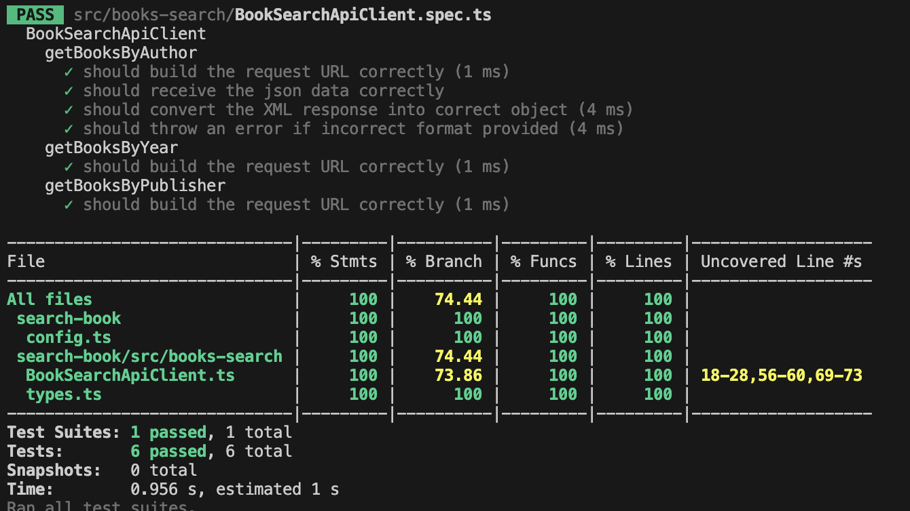

# Javascript Code Test

`BookSearchApiClient` is a simple class that makes a call to a http API to retrieve a list of books and return them.

You need to refactor the `BookSearchApiClient` class, and demonstate in `example-client.js` how it would be used. Refactor to what you consider to be production ready code. You can change it in anyway you would like and can use javascript or typescript.

Things you will be asked about:

1. How could you easily add other book seller APIs in the the future
2. How woud you manage differences in response payloads between differnt APIs without needing to make future changes to whatever code you have in example-client.js
3. How would you implement different query types for example: by publisher, by year published etc
4. How your code would be tested

# Getting started

`BookSearchApiClient` is a simple Typescript class that calls the API using different path and query to return the list of books based on search path.

## Build the app

To install the dependencies
`npm install`

To build the app
`npm run build`

To run unit tests
`npm run test`

To check coverage
`npm run coverage`

To run typescript 
`npm run tsc`

## In this app

From the Given sample, the API response would be array of Books details and its stock - quantity and price.
Based on search path and query params, you can get the list of books.
1. getBooksByAuthor - Gives the books based on Author name
2. getBooksByYear - Gives the books by its published year
3. getBooksByPublisher - Gives the books list by the name of its publisher company
4. config.ts is added so the API or its path changed, updating this file with new path will give the response.

### Coverage

### Libraries used

1. axios - to call the API and get the response
2. xmlbuilder2 - to read the xml string and convert to json response
